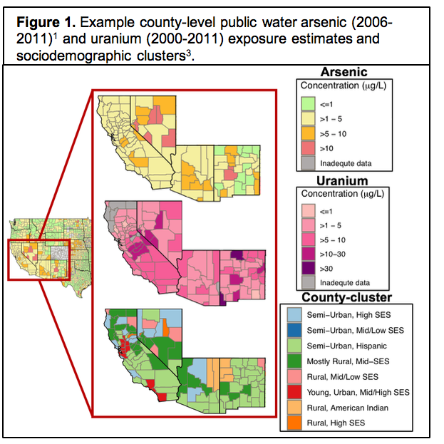
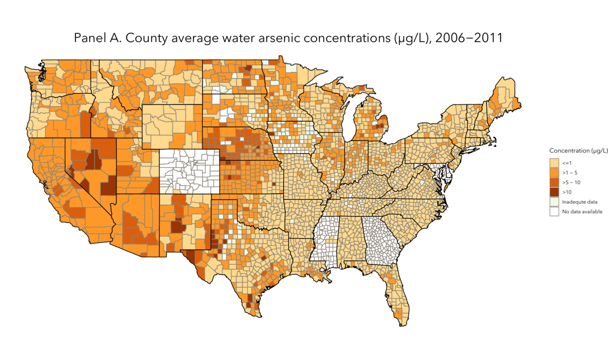

### <b>Current Projects </b>
 

### Environmental justice and inequalities in public drinking water contaminant exposures

 

We are developing nationwide public drinking water contaminant exposure estimates at multiple geographic resolutions to characterize racial/ethnic and socioeconomic inequalities in public drinking water contaminant exposures nationwide. Findings from these projects can inform public health interventions and regulatory action with the ultimate goal of reducing inequalities in both drinking water contaminant exposures and adverse health outcomes across racial/ethnic and socioeconomic subgroups. 
 
 
<b>We developed the [Columbia Drinking Water Dashboard,](https://msph.shinyapps.io/drinking-water-dashboard/) which contains interactive maps and tables of regulated public water contaminants. The Dashboard is routinely being updated with new exposure estimates. </b>
 
 
 
 
 
 
 
 

### Arsenic exposure in US drinking water & related mortalities

 
This project evaluates the association between water & dietary arsenic exposure and cardiovascular and all-cause mortality in the US population. We are leveraging several large, national-scale, publicly-available databases and developing new statistical methods to overcome several challenges inherent to this type of secondary data analysis, including:
<ul><li><i>Novel Bayesian models to multiply impute values below detection limits</i></li>
<li><i>Novel biomarkers to isolate arsenic internal dose from drinking water</i></li>
<li><i>Estimated public drinking water arsenic exposures for the entire US population</i></li></ul>
Replication code/archive and datasets created for public use as a product of this project are available via my [GitHub](https://github.com/annenigra/epa-public-water-arsenic) upon publication.
 
 
 
 

### Drinking water quality in correctional facilities
We published the [first study](https://www.ncbi.nlm.nih.gov/pubmed/32585331) of drinking water quality in correctional facilities across the US. Our work found elevated drinking water arsenic exposure for incarcerated populations in the Southwestern US (2006-2011). We're currently expanding this work to evaluate additional regulated drinking water contaminants.

 
 
 
 

### Mercury exposure assessment: a community-directed research project
We are working with community-based collaborators in the Northern Plains to design and implement a pilot study to characterize mercury exposure in tribal communities using both biomonitoring and environmental monitoring. A key component of this project is the inclusion of local high school students in field work/data collection, data analysis, and results dissemination. We mentor local students through high school science fair projects related to population- and community-level metal exposure assessment and plan to expand this collaboration further beyond the aims of this specific project.
 

 

