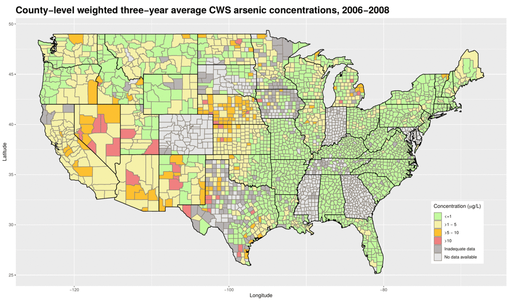
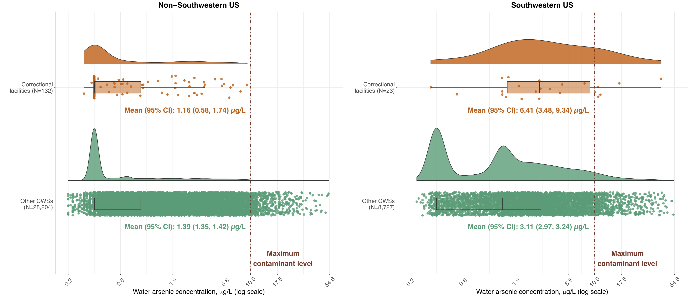
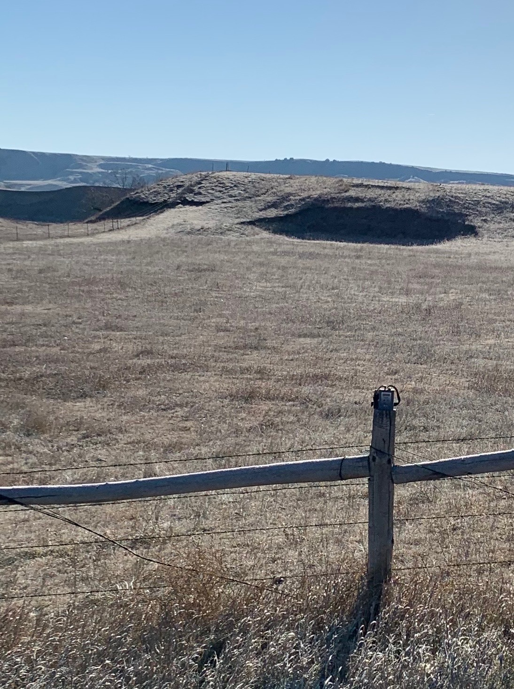

 

### Arsenic Exposure in US Drinking Water: Spatial Patterns, Temporal Trends, and Related Mortalities
This project analyzes spatial patterns and temporal trends in public drinking water arsenic exposure, identifies subgroups that remain susceptible to higher exposure levels, and evaluates the association between water arsenic exposure and cardiovascular and all-cause mortality. We are leveraging several large, national-scale, publicly-available databases and developing new statistical methods to overcome several challenges inherent to this type of secondary data analysis, including:
<ul><li><i>Novel Bayesian models to multiply impute values below detection limits</i></li>
<li><i>Novel biomarkers to isolate arsenic internal dose from drinking water</i></li>
<li><i>Estimated public drinking water arsenic exposures for the entire US population</i></li></ul>
 

<b>For an interactive version of this map, see the [Columbia Arsenic Map](https://annenigra.github.io/ColumbiaArsenicMap).</b>

Replication code/archive and datasets created for public use as a product of this project are available via my [GitHub](https://github.com/annenigra/epa-public-water-arsenic) upon publication.
 
 

### Drinking water quality in correctional facilities
We published the [first study](https://www.ncbi.nlm.nih.gov/pubmed/32585331) of drinking water quality in correctional facilities across the US. Our work found elevated drinking water arsenic exposure for incarcerated populations in the Southwestern US (2006-2011). We're currently expanding to additional water contaminants.
 

### Mercury exposure assessment: a community-directed research project
We are working with community-based collaborators in the Northern Plains to design and implement a pilot study to characterize mercury exposure in tribal communities using both biomonitoring and environmental monitoring. A key component of this project is the inclusion of local high school students in field work/data collection, data analysis, and results dissemination. We mentor local students through high school science fair projects related to population- and community-level metal exposure assessment and plan to expand this collaboration even further beyond the aims of this specific project.
 

 

