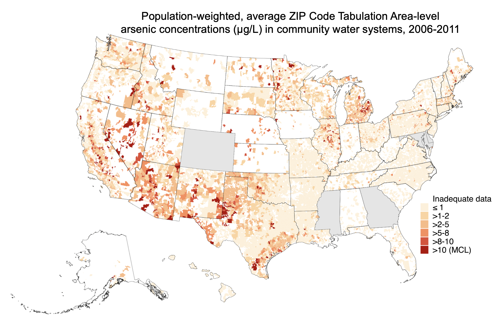
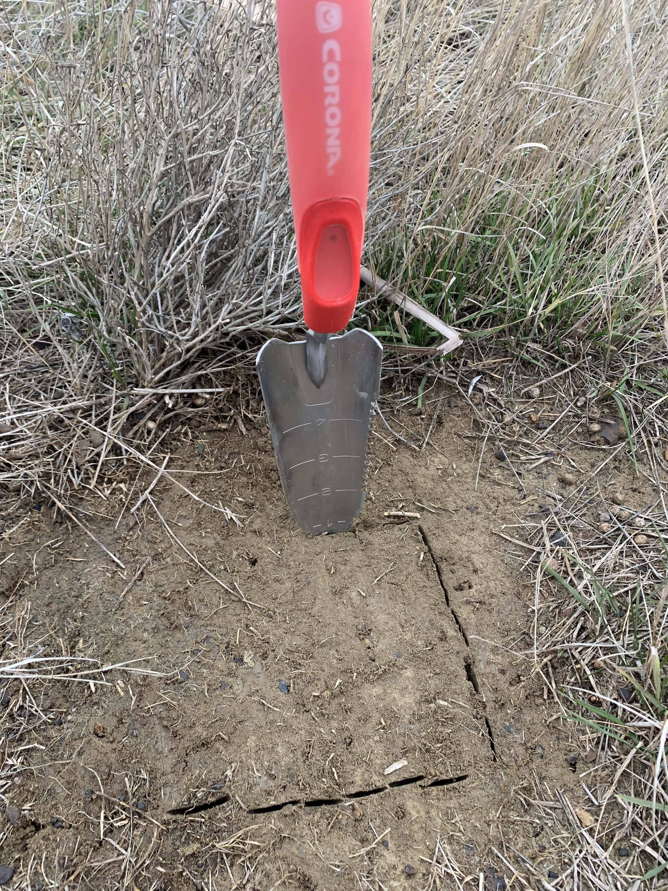
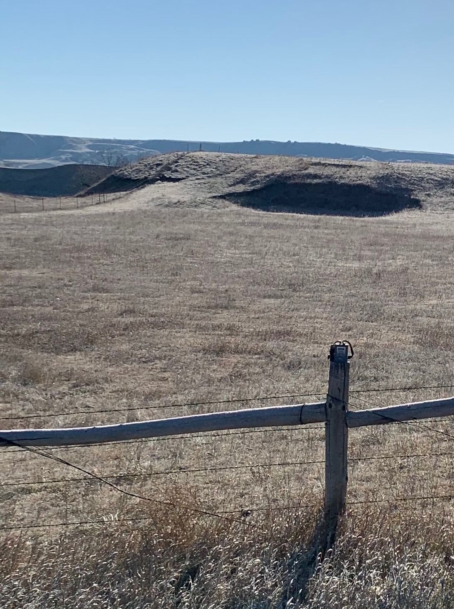
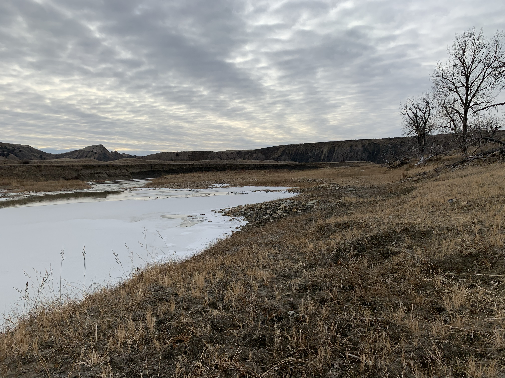
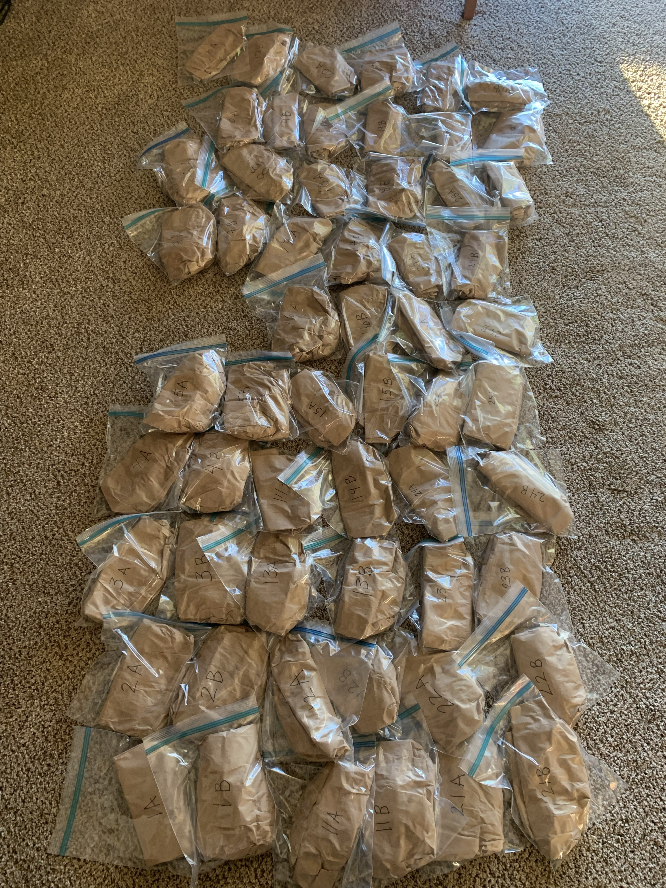
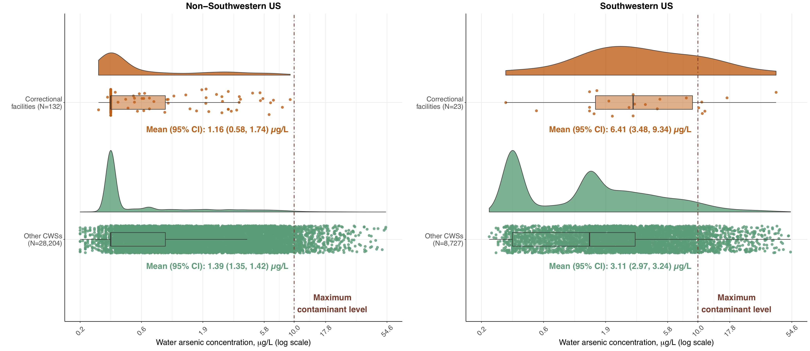

 
 
 
 
 

 
 

<b>Current Major Projects:</b>

 

<b>Improving US Public Water Exposure Assessment and Epidemiology</b>

We develop and improve novel, nationwide estimates of contaminant concentrations at various spatial and temporal resolutions for use in epidemiological research. We characterize racial, ethnic, and socioeconomic inequities in public drinking water contaminant exposures nationwide, and estimate the contribution of public water to total exposures. We collaborate with several multi-site NIH-funded cohorts to evaluate epidemiologic associations with relevant adverse outcomes, because public water contaminant exposures are <i>directly modifiable by state and federal regulatory action</i>.
 

<b>We developed the [Columbia Drinking Water Dashboard](https://msph.shinyapps.io/drinking-water-dashboard/), which contains interactive maps and tables of regulated public water contaminants. The Dashboard is routinely updated with new exposure estimates.</b>

 
 

 

<b>Public Drinking Water Contaminants and Infant Health</b>

We are evaluating the contribution of public drinking water contaminant exposures to <i>in utero</i> water contaminant exposures and subsequent adverse birth and maternal outcomes across the United States. We work with several large cohorts to characterize the impacts of historical regulatory changes and estimate the impact of potential future regulatory changes. Our goal is to produce work that directly informs public health interventions and regulatory actions to reduce inequities in both drinking water contaminant exposures and infant and maternal outcomes.

 
 

<b>Water for Health: Strengthening Tribal Action for Cancer Prevention</b>

We aim to address longstanding disparities in cancer incidence and mortality in American Indian communities by addressing relevant modifiable drinking water exposures. Leveraging decades of collaboration with the Strong Heart Study (SHS), we are conducting individualized comprehensive exposure assessments of drinking water arsenic and uranium for each several communities, evaluating the epidemiologic association between drinking water exposures with associated cancers in the SHS, and supporting communities in developing individualized intervention plans, incorporating Indigenous knowledge, values, priorities, strengths, and needs. Through these participatory-based and multidisciplinary approaches, this project will ensure that American Indian communities are represented in the epidemiologic science driving federal regulatory decision making for drinking water contaminants and infrastructure investments. This project is a component of the Improving Cancer Outcomes in Native American Communities (ICON) U19 center, led by MPI team Drs. Dorothy Rhoades, Paul Spicer, and Mark Doescher, at the [Native American Center for Cancer Health Equity, NACCHE, at the University of Oklahoma Health Sciences Stephenson Cancer Center](https://nacche.ouhsc.edu/).

 
 

<b>Water Contaminants and Cardiovascular Risk: the Jackson Heart Study</b>

In Jackson, MS, decades of under-investment in public water system infrastructure have resulted in severe disruptions to water access and diminished water quality. Jackson has been under a consent decree since 2012 for failing to meet operational and maintenance standards and continues to have boil water notices issued regularly, eliciting concern about the health effects of chronic water contaminant exposures. We are assessing drinking water contaminant exposures in the Jackson Heart Study, assess their epidemiologic association with both subclinical and clinical cardiovascular outcomes, and evaluating the association between drinking water contaminants assessed using compliance monitoring records and circulating markers reflecting the molecular exposome.

 
 

<b>The EARTH Program</b>

<b>EnvironmentAl health sciences Research for Teachers and High school students (EARTH)</b>

The [EARTH Program](https://www.publichealth.columbia.edu/academics/departments/environmental-health-sciences/programs/non-degree-offerings/earth-program) is a structured summer environmental health sciences research program for high school students and teachers from three Native communities in the Northern Plains. Locally based teams conduct high-quality, locally relevant environmental health sciences research through collaboration with Columbia University and [Missouri Breaks Industries Research Inc.](https://www.missouri-breaks.com/) Teams leverage ongoing research projects and collaborations in the area, including activities related to the [Columbia Northern Plains Superfund Research Program](https://www.mailman.columbia.edu/research/columbia-superfund-research-program).

 

 
 
 

<b>Data and solutions for impacts of climate-related extremes on incarcerated people in the United States</b>

In a collaboration led by [Dr. Robbie Parks, PI](https://sparklabnyc.github.io/site/home.html), we aim to identify major solutions for climate exposures impacting incarcerated populations. Incarcerated people in the US face deadly and growing climate-related exposures, yet, critical knowledge gaps remain in producing publicly usable data to inform policies and drive action to mitigate risks. Bringing together academic, formerly incarcerated, community, policy, legal and journalism partners, our objectives are to identify potential mitigation methods, conduct community engagement activities, and identify ways to operationalize findings for policy impact across scales. 

