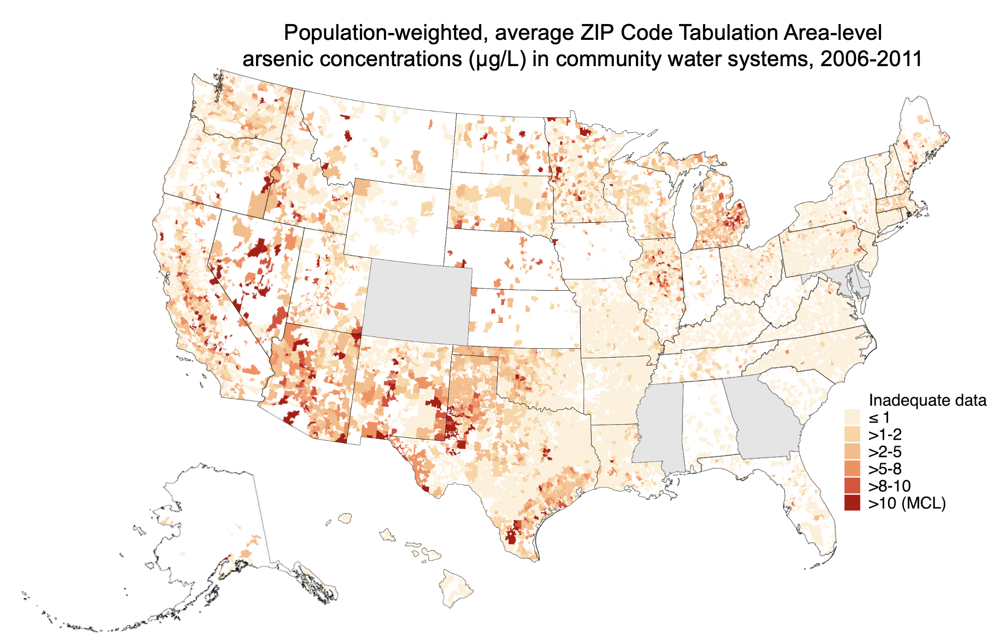

 
 

<b>Current projects</b>

 

<b>Improving US public water exposure assessment and epidemiology</b>

We've developed novel, nationwide estimates of contaminant concentrations at various spatial and temporal resolutions for use in epidemiological research. We're characterizing racial, ethnic, and socioeconomic inequities in public drinking water contaminant exposures nationwide, and estimating the contribution of public water to total exposures. We're collaborating with several multi-site NIH funded cohorts to evaluate epidemiologic associations with relevant adverse outcomes, because public water contaminant exposures are <i>directly modifiable by state and federal regulatory action</i>. 
 
 
<b>We developed the [Columbia Drinking Water Dashboard,](https://msph.shinyapps.io/drinking-water-dashboard/) which contains interactive maps and tables of regulated public water contaminants. The Dashboard is routinely updated with new exposure estimates. </b
 
 
 

 

<b>Public drinking water contaminants and infant health: Advancing environmental justice</b>

We're evaluating the contribution of racial/ethnic and socioeconomic inequalities in public drinking water contaminant exposures to <i>in utero</i> water contaminant exposures and subsequent adverse birth and maternal outcomes across the United States. We're working with several large cohorts to characterize the impacts of historical regulatory changes, and estimate the impact of potential future regulatory changes. Our goal is to produce work that directly informs public health interventions and regulatory actions to reduce inequities in both drinking water contaminant exposures and infant and maternal outcomes.

 
 

<b>The EARTH Program: EnvironmentAl health sciences Research for Teachers and High School students.</b>

The Environmental heAlth sciences Research for Teachers and High school students [(EARTH) Program](https://www.publichealth.columbia.edu/academics/departments/environmental-health-sciences/programs/non-degree-offerings/earth-program) is a structured summer environmental health sciences research program for high school students and teachers from three Native communities in the Northern Plains. Locally based teams conduct high-quality, locally relevant environmental health sciences research through collaboration with Columbia University and [Missouri Breaks Industries Research Inc.](https://www.missouri-breaks.com/) researchers. Teams leverage ongoing research projects and collaborations in the area, including activities related to the [Columbia Northern Plains Superfund Research Program](https://www.mailman.columbia.edu/research/columbia-superfund-research-program). 
 

 
 

<b>Other interests</b>

We're also working on environmental exposures associated with incarceration, cumulative exposures, metal/metalloid biomarker studies, metals and cardiovascular disease, and novel, unregulated environmental exposures.

