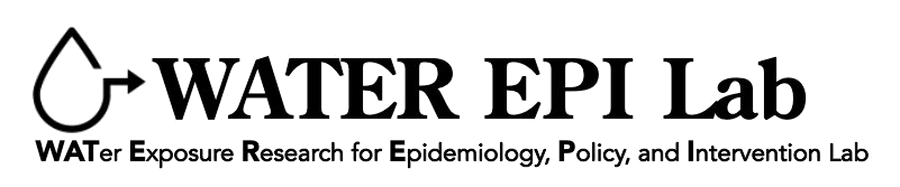

 
 
 
 
 

 
 

 
 

<b>Welcome!</b>

Our lab is based in the [Department of Environmental Health Sciences](https://www.mailman.columbia.edu/academics/departments/environmental-health-sciences-ehs) at the Columbia University [Mailman School of Public Health](https://www.mailman.columbia.edu/). Our team conducts justice-oriented research on US drinking water epidemiology and exposure assessment, metal exposures, chronic disease, and maternal and infant health, leveraging collaborations with several large NIH-funded cohorts.

Recent work by our group includes epidemiologic analyses of public water contaminants and infant, maternal, and chronic adverse outcomes; methodological advances for public water exposure assessment; evaluations of federal drinking water policies and regulatory changes; and analyses of injustices in public drinking water contaminants.

Our long-term scientific goal is to reduce disparities in environmental exposures and adverse health outcomes, and improve health for all. By advancing public water exposure assessment, epidemiology, and policy/intervention work across the US, we aim to advance environmental justice, improve health equity, and directly inform regulations and other exposure-reduction interventions.

 

<b>["Health is a human right. The public health community exists to safeguard that right."](https://www.publichealth.columbia.edu/about/mission-history/public-health-oath#:~:text=Health%20is%20a%20human%20right.)</b>

 
