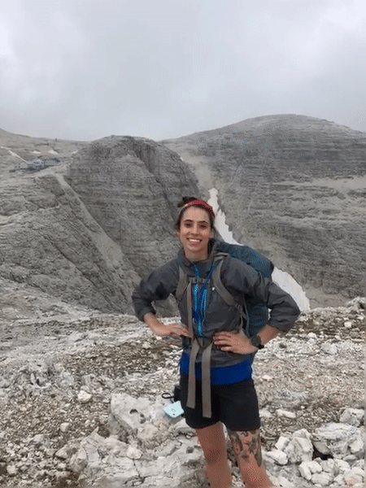

 
I'm an environmental health scientist and environmental epidemiologist. My work focuses on understanding the relationship between metal exposures (arsenic, mercury, lead, etc.) and related disease, and on assessing population-level metal exposures using both biological and environmental monitoring. 
 
 
I am most invested in and motivated by projects that:
<ul><li>Inform and evaluate federal regulations intended to reduce environmental exposures and related adverse health outcomes,</li>
<li>Are community- owned/directed/managed, or</li>
<li>Assess environmental injustices and aim to ultimately <u>eliminate health disparities.</u></li></ul>
 
I'm currently an Assistant Professor in the [Department of Environmental Health Sciences](https://www.mailman.columbia.edu/academics/departments/environmental-health-sciences-ehs) at Columbia University's [Mailman School of Public Health](https://www.mailman.columbia.edu/), and am involved with the [Columbia University Superfund Research Program](https://www.mailman.columbia.edu/research/columbia-superfund-research-program). I hold a Ph.D in Environmental Health Sciences from Columbia University's [Mailman School of Public Health](https://www.mailman.columbia.edu/) (2020), a Sc.M. in Environmental Epidemiology from [Johns Hopkins Bloomberg School of Public Health](https://www.jhsph.edu/) (2016), and a B.A. in Biology from [Oberlin College](https://www.oberlin.edu/) (2014), where I also studied Gender, Sexuality, and Feminist Studies.   
 

<b>["Health is a human right. The public health community exists to safeguard that right."](https://www.publichealth.columbia.edu/about/mission-history/public-health-oath#:~:text=Health%20is%20a%20human%20right.)</b>
