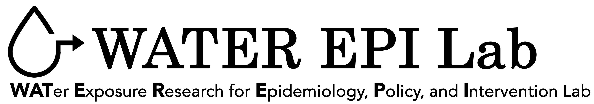

 
 
 
 
 

 
 

<b>Welcome!</b>

 
 

 
 
Our Lab is based in the [Department of Environmental Health Sciences](https://www.mailman.columbia.edu/academics/departments/environmental-health-sciences-ehs) at the Columbia University [Mailman School of Public Health](https://www.mailman.columbia.edu/). Our team conducts justice-oriented research on US drinking water epidemiology and exposure assessment, metal exposures, chronic disease, and maternal and infant health, leveraging collaborations with several large NIH-funded cohorts. Recent work by our group includes epidemiologic analyses of public water contaminants and infant, maternal, and chronic adverse outcomes; methodological advances for public water exposure assessment; evaluations of federal drinking water policies and regulatory changes; and analyses of injustices in public drinking water contaminants.

Our long term scientific goal is to reduce racial, ethnic, and socioeconomic inequities in environmental exposures and adverse health outcomes, and improve health for all (yes, that’s ambitious). By advancing public water exposure assessment and epidemiology across the US, we aim to advance environmental justice, improve health equity, and directly inform regulations and other exposure reduction interventions. 

<b>["Health is a human right. The public health community exists to safeguard that right."](https://www.publichealth.columbia.edu/about/mission-history/public-health-oath#:~:text=Health%20is%20a%20human%20right.)</b>
 

