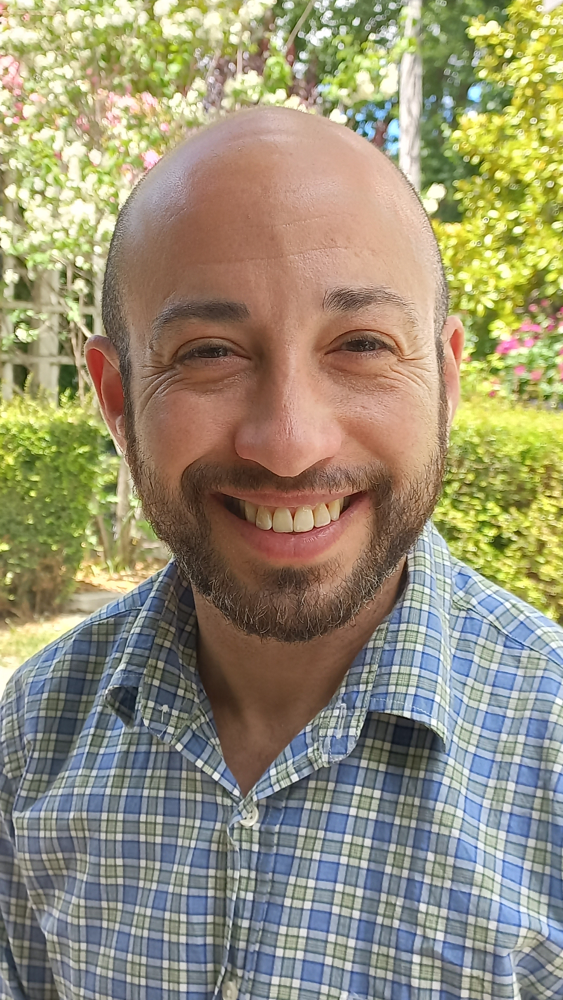
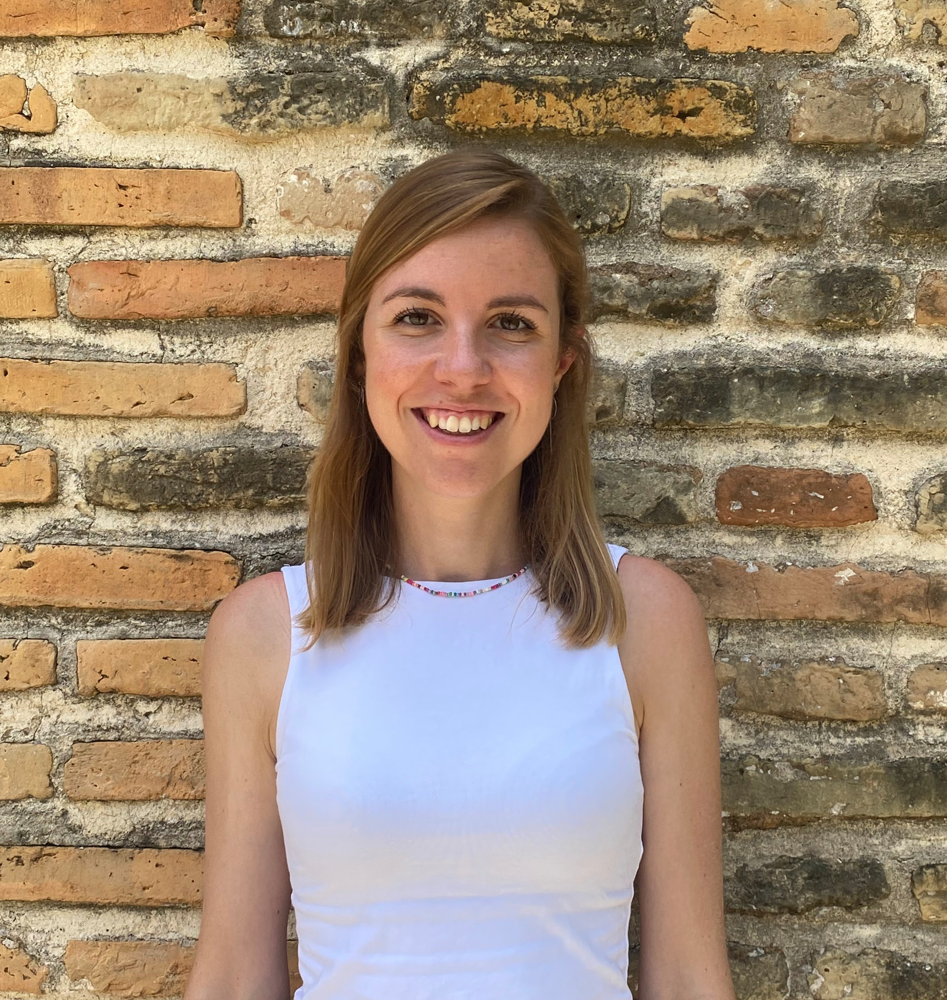
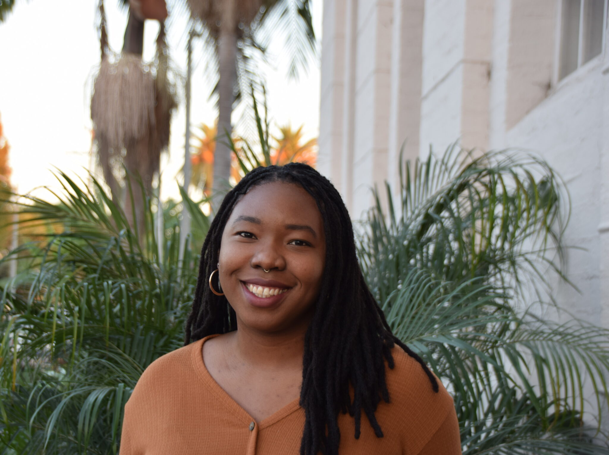

 
 

<b>Team</b>

 

 
 
<b>Annie Nigra, ScM, PhD, Assistant Professor</b> 
[Annie (she/her)](https://www.publichealth.columbia.edu/profile/anne-annie-nigra-phd) is an environmental epidemiologist and environmental health scientist, and an Assistant Professor in the [Department of Environmental Health Sciences](https://www.mailman.columbia.edu/academics/departments/environmental-health-sciences-ehs) at the Columbia University [Mailman School of Public Health](https://www.mailman.columbia.edu/). In addition to leading the WATER EPI Lab, Annie leads the Research Experiences and Training Coordination Core for the [Columbia University Superfund Research Program](https://www.mailman.columbia.edu/research/columbia-superfund-research-program) and the [EARTH Program](https://www.publichealth.columbia.edu/academics/departments/environmental-health-sciences/programs/non-degree-offerings/earth-program). Outside of the Lab, you can find Annie trail running, hiking, and running/biking around the NYC public park system with her family.
 
 
 
 

 
<b>Ilan Cerna-Turoff, MA, MPH, PhD, Postdoctoral Research Scientist</b> 
Ilan is an epidemiologist whose research examines the associations between social, environmental, and climate related-exposures and health, mainly in low- and middle-income countries and in populations under 18 years of age. He also is a methodologist who adapts casual inference methods to challenging population-based exposures, with the goal of improving evidence where it is lacking and providing policy-actionable information. Ilan currently serves as a Postdoctoral Research Scientist in support of study design and analysis for several projects with the Lab, including a study of how Environmental Protection Agency (EPA) policy change in regulating water arsenic levels influenced maternal and child health in the state of California. You can find Ilan on [LinkedIn](https://www.linkedin.com/in/ilancernaturoff/) and <a href = "mailto: t2208@cumc.columbia.edu ">by email</a>.
 
 
 
 
 
 
 
 

 
<b>Wil Lieberman-Cribbin, MPH, PhD candidate</b> 
Wil is a PhD candidate in Environmental Health Sciences at Columbia University’s Mailman School of Public Health. He studies the relationship between metal exposures in drinking water and the body and how these exposures are associated with cardiovascular disease in American Indians participating in the Strong Heart Study. Wil also studies epigenetic biomarkers of lead exposure and relationships between metal exposures and DNA methylation signatures. You can find Wil on [LinkedIn](https://www.linkedin.com/in/wil-lieberman-cribbin-7b633246), [Twitter](https://twitter.com/Wil_LC1), and <a href = "mailto: wfl2112@cumc.columbia.edu ">by email</a>.
 
 
 
 
 
 
 
 

 
<b>Irene Martinez-Morata, MD, MPH, PhD candidate</b> 
Irene is a PhD candidate in Environmental Health Sciences at Columbia University’s Mailman School of Public Health. Her current research with the WATER EPI Lab focuses on understanding and uncovering major drivers of drinking water contaminant disparities in the US and their impact on communities' health, with a focus on structural racism and social vulnerability factors. She is interested in identifying and developing innovative prevention and mitigation strategies to potentially tackle pressing environmental justice concerns affecting historically marginalized communities in the US.
 
 
 
 
 

 
<b>Kevin Patterson MPH, PhD student</b> 
Kevin is a Diné PhD student in Environmental Health Sciences at Columbia University’s Mailman School of Public Health. His research investigates the distribution of metal exposures (uranium, arsenic, etc.) in groundwater and diet across US indigenous communities and their relationship with chronic health conditions. To do this, he relies on epidemiology, biostatistical and qualitative methods. He aims to inform tribal and federal regulations to reduce environmental exposures in rural, historically marginalized communities. He is currently a Superfund Research Program Trainee at Columbia and Gates Millennium Scholar. He holds an MPH in Environmental Health Sciences from Columbia Mailman School of Public Health and a BA from Dartmouth College. He seeks to expand research capacity in indigenous health and strives to increase Native representation in STEM. Kevin is an [Agents of Change Fellow.](https://agentsofchangeinej.org/fellows/kevin-patterson/) You can reach Kevin <a href = "mailto: kpp2126@cumc.columbia.edu ">by email</a>.
 
 
 
 
 
 
 

 
<b>Raenita (Rae) Spriggs MPH, PhD student</b> 
Rae (she/her) is a second year EHS doctoral student from San Diego, CA. She has two ongoing research projects. One project is exploring and characterizing multiple environmental exposures (drinking water quality, extreme heat, etc.) impacting U.S. correctional facilities. The other project is evaluating temporal trends in mental health related mortality in response to extreme climate events such as tropical cyclones. Rae's work sits at the intersection of climate change, environmental justice, and mental health. 
 
 
 
<b>Tessa R Bloomquist, MPH, PhD candidate</b> 
<b>Ishika Kaushal, MPH student</b> 
<b>Adina Cazacu-De Luca, undergraduate student</b> 
 
 
 
 

<b>Prior team members</b>

<b>Maya Spaur, ScM, PhD,</b> now a Postdoc at NCI 
<b>Filippo Ravalli, MPH,</b> now a MD student at Columbia University 
<b>Ellen Bannon, MPH</b>

