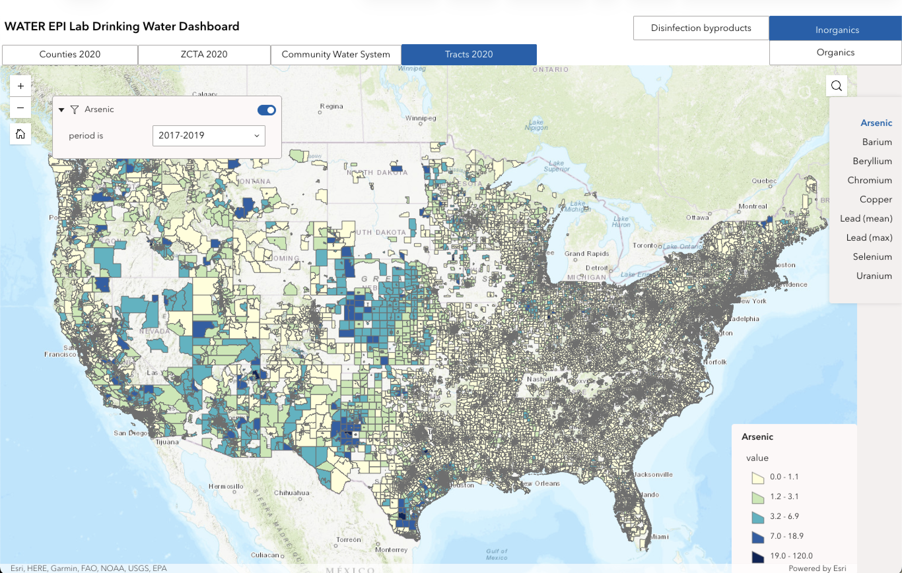

 
 
The [WATER EPI Lab Drinking Water Dashboard](https://experience.arcgis.com/experience/e8bd96af1a26455cb68e35e19c2d3682) is an interactive map (with accompanying data repository) of regulated contaminant concentration estimates in community water systems across the US for both researchers and the public. Users can explore spatial and temporal variability in contaminant concentrations and download datasets for use. Contaminant concentration estimates are derived from routine compliance monitoring records reported by public water systems to primacy agencies. Contaminant concentration estimates are designed for use in epidemiologic analyses. Estimates (1) are aggregated to time periods reflecting the US Environmental Protection Agency’s standardized monitoring requirements (to reduce differential missingness and bias), (2) reflect concentrations distributed to consumers in finished ("treated") water, and (3) are aggregated to multiple spatial geographies (water systems, census tracts, ZCTAs, counties) and vintages to facilitate linkage with a wide variety of location formats. 
 
 

 
 
 

<b>How to use the Dashboard</b>

Interactive maps of public water system contaminant concentrations are organized by contaminant class (inorganics/radionuclides, organics, and disinfection byproducts). Contaminant concentrations at the census tract, ZCTA, and county level are population-weighted averages. Contaminant concentrations are aggregated to temporal periods that align with the the US Environmental Protection Agency’s Standardized Monitoring Framework (additional averaging periods are available in the underlying data which can be accessed via the repository linked below). Please note most federally regulated organic contaminants are rarely detected in public drinking water and exhibit low variability. 
 
 

<b>Repository and citing the Dashboard</b>

A full repository with datafiles, codebooks, and documentation [is published via Zenodo and available here](https://zenodo.org/records/20443826). A manuscript is forthcoming.
 
 

<b>Brief methodological details</b>

Estimates are derived from millions of compliance monitoring records submitted by water systems to states and tribal agencies for monitoring compliance. Most records are extracted from the US Environmental Protection Agency’s datasets in support of the Six Year Review of drinking water standards. Individual monitoring record values measured below the limit of detection were replaced by the limit of detection divided by the square root of two prior to averaging concentrations. Low estimated averages may therefore reflect water systems which did not measure concentrations of a particular contaminant above the limit of detection. Estimated concentrations account for reported water treatment to reflect concentrations distributed to consumers. Concentration estimates are averaged to time periods that reflect US EPA compliance monitoring period requirements to reduce differntial missingness when comparing across systems/areas. See [the repository](https://zenodo.org/records/20443826), [Ravalli et al. 2022](https://pubmed.ncbi.nlm.nih.gov/35397220/), [Nigra et al. 2020](https://pubmed.ncbi.nlm.nih.gov/33295795/), and [Nigra et al. 2025](https://pubmed.ncbi.nlm.nih.gov/40522663/) for a detailed description of materials and methods.

We would be happy to help you make the best and most appropriate use of these datasets for your work. Please contact Dr. Annie Nigra at aen2136@cumc.columbia.edu with any questions.
